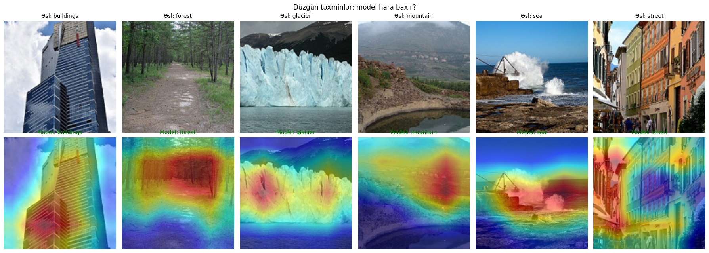
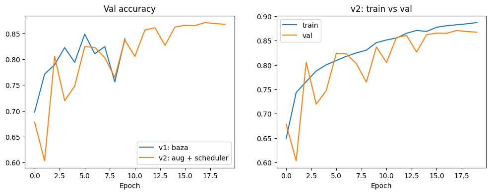

# Intel Scene Classification: From Scratch CNN to Transfer Learning

Classifying natural scene images into 6 categories (buildings, forest, glacier, mountain, sea, street), with a focus on **why** models fail, not just how accurate they are.



## Results

| Model | Parameters | Epochs | Val accuracy | Test accuracy |
|---|---|---|---|---|
| v1: Simple CNN (baseline) | ~0.4M | 10 | 0.839 | `[fill]` |
| v2: CNN + augmentation + cosine LR | ~0.4M | 20 | `[fill: ~0.87]` | `[fill]` |
| **v3: ResNet18 transfer learning** | **11.2M** | **6** | **0.951** | **0.942** |

Final model: **ResNet18, 94.2% test accuracy** (173 errors out of 3,000 images).
The model was selected on validation accuracy *before* the test set was used. The test set was evaluated exactly once.
Val (95.1%) and test (94.2%) results are within 1 point, which indicates the validation split was a reliable estimate and there is no data leakage.



## Key findings

### 1. The small CNN learned a color shortcut instead of shapes
The baseline CNN had high recall but low precision on `sea`:

| Class | Precision | Recall |
|---|---|---|
| sea | 0.726 | 0.942 |
| buildings | 0.915 | 0.728 |

The model predicted `sea` whenever it was unsure. Glaciers, snowy mountains and blue skies share the same blue and white tones as the sea, so the small network relied on color rather than structure (shortcut learning). This was one of the main reasons for moving to a pretrained model.

### 2. A learning rate scheduler fixed unstable validation
With a constant learning rate, validation accuracy jumped between 75% and 85% from one epoch to the next. With a cosine schedule, validation stabilized after epoch ~11 as the learning rate decayed. Saving the **best** checkpoint rather than the last one mattered: stopping v1 at epoch 9 would have kept a 75% model.

### 3. Transfer learning beat 20 epochs of training in 1 epoch
ResNet18 pretrained on ImageNet reached 92.4% validation accuracy after its first epoch, already above the best from-scratch result. A 10x smaller learning rate (1e-4) was used to avoid destroying the pretrained features.

### 4. Early signs of overfitting were caught
By epoch 6, train accuracy (98.6%) was 3.5 points above validation (95.1%) and the gap was growing. Training was stopped at 6 epochs.

## Error analysis

The most confused class pairs on the test set:

| Pair | Errors | Share of all errors |
|---|---|---|
| `[fill]` glacier ↔ mountain | `[fill]` | `[fill]` |
| `[fill]` buildings ↔ street | `[fill]` | `[fill]` |

A manual review of 30 random test errors:

| Category | Count |
|---|---|
| Model was wrong (label is correct) | `[fill]` |
| Label was wrong (model was right) | `[fill]` |
| Ambiguous (both classes are reasonable) | `[fill]` |

`[fill: one sentence conclusion, e.g. "About half of the remaining errors come from dataset ambiguity rather than the model."]`

Grad-CAM shows where the model looks when it makes a decision. `[fill: what you observed, e.g. "For sea predictions the model focuses on the water surface, not the sky."]`

## Data

- Source: [Intel Image Classification on Kaggle](https://www.kaggle.com/datasets/puneet6060/intel-image-classification)
- ~14K train images, 3K test images, 150x150 px, 6 classes
- Split: `seg_train` was divided into 85% train / 15% validation with a fixed seed (42). `seg_test` was held out as the test set and used once.
- The dataset is not included in this repository. It is downloaded with `kagglehub` in the notebook.

## Method

| | v1 | v2 | v3 |
|---|---|---|---|
| Architecture | 4 conv blocks + BatchNorm + Dropout | same as v1 | ResNet18 (ImageNet weights), new 6-class head |
| Input size | 150x150 | 150x150 | 224x224 |
| Augmentation | none | RandomResizedCrop, HorizontalFlip, light ColorJitter | same as v2 |
| Optimizer | Adam, lr 1e-3 | Adam, lr 1e-3 | AdamW, lr 1e-4, weight decay 1e-4 |
| LR schedule | constant | cosine | cosine |
| Checkpoint | last epoch | best val | best val |

Color augmentation was kept deliberately light, because color is a real signal for classes like `sea` and `glacier`.

## How to run

The project runs on Google Colab with a free T4 GPU.

1. Open `notebooks/intel_scene_classification.ipynb` in Colab
2. Set **Runtime → Change runtime type → T4 GPU**
3. Run all cells. The dataset downloads automatically via `kagglehub`.

Local setup:

```bash
pip install -r requirements.txt
jupyter notebook notebooks/intel_scene_classification.ipynb
```

## Repository structure

```
intel-scene-classification/
├── notebooks/
│   └── intel.ipynb
├── assets/
│   ├── gradcam_examples.png
│   ├── confusion_matrix_test.png
│   └── training_curves.png
├── requirements.txt
└── README.md
```

## Limitations

- Images are only 150x150 px; fine details are lost.
- The dataset contains mislabeled and ambiguous images, which puts a ceiling on achievable accuracy.
- All images come from one source. Performance on photos from a different camera or region has not been tested.

## Next steps

- Retrain after removing or relabeling the mislabeled images found in error analysis, and measure the effect
- Compare ResNet18 with EfficientNet and a Vision Transformer
- Export the model to ONNX and serve it with a small Gradio demo

## Tech stack

Python, PyTorch, torchvision, scikit-learn, pytorch-grad-cam, matplotlib, Google Colab
